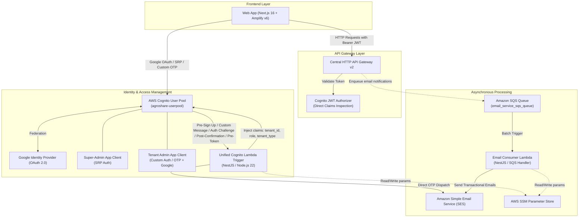

# 🌱 AgroShare Ghana — Serverless Agricultural Infrastructure Monorepo

[](https://turborepo.dev)
[](https://pnpm.io)
[](https://nextjs.org)
[](https://nestjs.com)
[](https://aws.amazon.com)
[](https://terraform.io)
[](https://www.typescriptlang.org)

**AgroShare** is a serverless, multi-tenant digital platform built to transform Ghana's agricultural value chain. By connecting farmer cooperatives, mechanization fleet operators, and cold-chain infrastructure providers on a single unified platform, AgroShare eliminates post-harvest loss and unlocks underutilized farm equipment from Tamale to Techiman.

---

## 📑 Table of Contents

- [Overview & Vision](#-overview--vision)
- [Monorepo Architecture](#-monorepo-architecture)
- [System Architecture](#-system-architecture)
- [Multi-Tenancy & Authentication](#-multi-tenancy--authentication)
  - [Tenant Profiles & ID Schema](#tenant-profiles--id-schema)
  - [Dual-Tier Authentication System](#dual-tier-authentication-system)
  - [Cognito Unified Lambda Triggers](#cognito-unified-lambda-triggers)
- [Applications & Packages](#-applications--packages)
  - [Web Application (`apps/web`)](#web-application-appsweb)
  - [Gateway Service (`apps/gateway-service`)](#gateway-service-appsgateway-service)
  - [Email Service (`apps/email-service`)](#email-service-appsemail-service)
  - [Shared Tooling (`packages/*`)](#shared-tooling-packages)
- [Tech Stack](#-tech-stack)
- [Getting Started](#-getting-started)
  - [Prerequisites](#prerequisites)
  - [Installation](#installation)
  - [Environment Configuration](#environment-configuration)
  - [Running Locally](#running-locally)
- [Infrastructure & Deployment](#-infrastructure--deployment)
  - [Terraform Modules](#terraform-modules)
  - [Deployment Order](#deployment-order)
  - [Lambda Compilation via esbuild](#lambda-compilation-via-esbuild)
- [Turborepo Workflows](#-turborepo-workflows)

---

## 🌍 Overview & Vision

Ghanaian agriculture faces critical structural challenges: smallholder farmers struggle with seasonal machinery shortages, cold storage is scarce and fragmented, and equipment owners suffer from idle machinery during off-peak windows.

AgroShare bridges these gaps through three core operational pillars:

1. **Farmer Cooperatives & Unions**: Aggregate member demand, book shared tractors and combine harvesters, and place bulk produce orders.
2. **Mechanization Fleet Owners**: Monetize tractors and equipment with real-time route tracking, maintenance logs, and plowing service requests.
3. **Cold-Chain & Infrastructure Providers**: Optimize cold storage capacity, monitor IoT temperature telemetry, and manage crate-based billing to mitigate perishability losses.

---

## 🏗 Monorepo Architecture

This repository is organized as a high-performance monorepo powered by **Turborepo** and **pnpm workspaces**:

```text
agroshare-serverless/
├── apps/
│   ├── web/                     # Next.js 16 client application (App Router, Tailwind v4, Amplify v6)
│   ├── gateway-service/         # NestJS 11 AWS Lambda handling Cognito Auth Triggers & API Gateway
│   └── email-service/           # NestJS 11 AWS Lambda SQS-driven worker for transactional emails
├── packages/
│   ├── eslint-config/           # Shared ESLint rule configurations
│   └── typescript-config/       # Shared tsconfig.json configurations
├── package.json                 # Root dependencies and monorepo scripts
├── pnpm-workspace.yaml          # pnpm workspace definition
└── turbo.json                   # Turborepo task pipeline definition
```

---

## 🛰 System Architecture

The following diagram illustrates how incoming traffic, authentication flows, microservices, and asynchronous event pipelines interact:



---

## 🔐 Multi-Tenancy & Authentication

### Tenant Profiles & ID Schema

AgroShare enforces strict tenant isolation. During onboarding, tenants choose their operational profile, and the system cryptographically generates a standardized, human-readable identifier:

| Tenant Type             | Prefix  | Description                                        | Example ID                    |
| :---------------------- | :------ | :------------------------------------------------- | :---------------------------- |
| **Farmer Cooperative**  | `coop_` | Manages farmer rosters, bulk orders, USSD requests | `coop_ashanti-farmers_7k9a2x` |
| **Mechanization Fleet** | `flt_`  | Manages tractor/combine fleets, plowing requests   | `flt_volta-tractors_8m2z1q`   |
| **Cold-Chain Operator** | `cld_`  | Tracks storage capacity, IoT temperature logs      | `cld_accra-coldstore_4j1k9p`  |

Tenant IDs are generated via:
$$\text{Tenant ID} = \text{prefix} + \text{"\_"} + \text{slug(organization\_name)}[0..30] + \text{"\_"} + \text{secureRandomString}(6)$$

### Dual-Tier Authentication System

1. **Super-Administrators**:
   - Authenticated via the `super_admin_client` using Secure Remote Password (**SRP** `ALLOW_USER_SRP_AUTH`).
   - Direct access to system-wide platform monitoring and global management.
2. **Tenant Administrators**:
   - Authenticated via the `tenant_admin_client` using **Passwordless Email OTP** (`ALLOW_CUSTOM_AUTH`) or **Google OAuth Federation**.
   - Custom client metadata (`tenant_id`, `role`, `tenant_type`) is bound upon signup and propagated through all authentication lifecycle events.

### Cognito Unified Lambda Triggers

A single, optimized NestJS Lambda function (`apps/gateway-service`) handles all Cognito trigger events:

- **`CustomMessage`**: Dynamically crafts branded HTML email notifications for user registration confirmation and password resets.
- **`PreSignUp`**: Automatically auto-verifies email addresses and parses `customState` during Google Social Federation sign-ups.
- **`AuthChallenge` (`DefineAuthChallenge`, `CreateAuthChallenge`, `VerifyAuthChallengeResponse`)**: Implements passwordless email OTP authentication:
  - Generates secure 6-digit numeric OTP codes.
  - Sends verification codes via SES.
  - Validates user input against private challenge parameters.
- **`PostConfirmation`**: Permanently updates user attributes in the Cognito User Pool (`custom:tenant_id`, `custom:tenant_type`, `custom:role`) after verification.
- **`PreTokenGeneration` (Version 2.0 Trigger)**: Injects `tenant_id`, `tenant_type`, and `role` directly into the generated JWT Access and ID tokens, while suppressing awkward `custom:` prefixes for downstream microservices.

---

## 📦 Applications & Packages

### Web Application (`apps/web`)

Modern, responsive web portal built with Next.js 16 and React 19.

- **Onboarding Flow**: 5-stage interactive onboarding wizard (Tenant Selection $\rightarrow$ Business Profile $\rightarrow$ Administrator Credentials $\rightarrow$ Live 6-digit OTP Verification $\rightarrow$ Tenant Launch).
- **Styling**: Tailwind CSS v4 with custom OKLCH color palettes and dynamic CSS transitions.
- **AWS Integration**: Configured with AWS Amplify v6 (`aws-amplify/auth`) supporting local endpoints (`http://localhost:4566`) and production User Pools.

### Gateway Service (`apps/gateway-service`)

Serverless NestJS 11 backend compiling to an AWS Lambda distribution.

- **Unified Cognito Handler**: High-performance entry point executing AWS Lambda triggers within a single cold-start lifecycle.
- **Infrastructure as Code**: Terraform module defining:
  - AWS Cognito User Pool with custom attribute schemas.
  - App Clients for Super-Admin and Tenant Admins.
  - Google Social Identity Provider integration.
  - HTTP API Gateway (v2) with a unified Cognito JWT Authorizer.
  - AWS SSM Parameter Store bindings for microservice service discovery.

### Email Service (`apps/email-service`)

Asynchronous notification engine processing background transactional communications.

- **SQS Consumer**: Processes batched SQS messages on AWS Lambda (`SQSEvent`).
- **Template Engine**: Formats emails for:
  - `WELCOME_EMAIL`: Welcomes newly verified tenant administrators.
  - `TENANT_PROVISIONED`: Notifies stakeholders of successful infrastructure provisioning.
  - `PASSWORD_RESET`: Transmits self-service password recovery instructions.
- **Infrastructure as Code**: Terraform module creating the SQS queue, SQS-to-Lambda event source mappings, SES domain identity verification, and IAM least-privilege roles.

### Shared Tooling (`packages/*`)

- `@repo/typescript-config`: Shared `tsconfig.json` configurations (`base.json`, `nextjs.json`, `react-library.json`).
- `@repo/eslint-config`: Standardized ESLint configs for Next.js, React, and general TypeScript services.

---

## 💻 Tech Stack

| Domain               | Technology / Service                              | Description                                                              |
| :------------------- | :------------------------------------------------ | :----------------------------------------------------------------------- |
| **Monorepo Engine**  | Turborepo + pnpm                                  | Pipeline caching, task orchestration, and workspace resolution           |
| **Frontend**         | Next.js 16, React 19, Tailwind CSS v4             | Server-side rendering, App Router, responsive design                     |
| **Auth Client**      | AWS Amplify v6 (`@aws-amplify/auth`)              | Multi-client switching, OAuth redirects, and custom challenge handling   |
| **Backend Services** | NestJS 11, Node.js 22.x, RxJS                     | Dependency injection, clean modular architectures, typed Lambda handlers |
| **Lambda Bundler**   | esbuild 0.28                                      | Tree-shaking, fast builds, sub-second cold starts                        |
| **Cloud Provider**   | AWS (Cognito, Lambda, API Gateway, SQS, SES, SSM) | Fully serverless, event-driven infrastructure                            |
| **Local Emulation**  | LocalStack / Ministack                            | Local AWS emulation running on `http://localhost:4566`                   |
| **Infrastructure**   | Terraform $\ge$ 1.5                               | Declarative cloud resource provisioning                                  |

---

## 🚀 Getting Started

### Prerequisites

Ensure you have the following installed on your local development machine:

- **Node.js**: `v18.0.0` or higher (Node.js 22 recommended)
- **pnpm**: `v9.0.0` or higher (`corepack enable && corepack prepare pnpm@9.0.0 --activate`)
- **Terraform**: `v1.5.0` or higher
- **Docker**: For running LocalStack / Ministack during local development
- **AWS CLI**: Configured for local or cloud credentials

### Installation

Clone the repository and install dependencies from the monorepo root:

```bash
git clone https://github.com/minast1/agroshare-serverless.git
cd agroshare-serverless
pnpm install
```

### Environment Configuration

#### 1. Web Application (`apps/web/.env`)

Create an `.env` file inside `apps/web/`:

```bash
NEXT_PUBLIC_USER_POOL_ID="us-east-1_example"
NEXT_PUBLIC_SUPERADMIN_CLIENT_ID="your_superadmin_client_id"
NEXT_PUBLIC_BASIC_USER_CLIENT_ID="your_tenant_admin_client_id"
NEXT_PUBLIC_DOMAIN="localhost"
NEXT_PUBLIC_SITE_URL="http://localhost:3000"
```

#### 2. Service Infrastructure Configurations

Configure `terraform.tfvars` files in the respective `infra/` directories:

- `apps/gateway-service/infra/terraform.tfvars`
- `apps/email-service/infra/terraform.tfvars`

Example `gateway-service/infra/terraform.tfvars`:

```hcl
environment                = "dev"
website_url                = "http://localhost:3000"
from_email_address         = "no-reply@agroshare.gh"
email_sending_account      = "COGNITO_DEFAULT"
domain                     = "agroshare.gh"
google_oauth_client_id     = "mock-google-client-id"
google_oauth_client_secret = "mock-google-client-secret"
aws_access_key_id          = "mock_key"
aws_secret_access_key      = "mock_secret"
resend_api_key             = "mock_resend_key"
super_admin_email          = "admin@agroshare.gh"
super_admin_password       = "Password123!"
```

### Running Locally

To run all applications concurrently in development mode:

```bash
pnpm dev
```

You can target specific services using Turborepo filters:

```bash
# Run only the web frontend
pnpm exec turbo dev --filter=web

# Run only the gateway microservice in watch mode
pnpm exec turbo dev --filter=gateway-service

# Run only the email microservice in watch mode
pnpm exec turbo dev --filter=email-service
```

Access the frontend application at [http://localhost:3000](http://localhost:3000).

---

## ☁️ Infrastructure & Deployment

### Terraform Modules

Each backend microservice maintains isolated Infrastructure as Code under its `infra/` directory:

1. **`apps/email-service/infra/`**:
   - Provisions the SQS email queue (`email_service_sqs_queue`).
   - Configures the SES domain or email verification.
   - Deploys the consumer Lambda function and SQS event source mapping.
   - Exports `/agroshare/${env}/ses/domain_identity_arn` and `/agroshare/${env}/sqs/email_queue_url` to SSM Parameter Store.

2. **`apps/gateway-service/infra/`**:
   - Reads the SES parameter export from SSM.
   - Deploys the unified Cognito trigger Lambda.
   - Provisions the Cognito User Pool, schemas, app clients, and Google Identity Provider.
   - Sets up the HTTP API Gateway v2 with Cognito JWT authorizer.
   - Exports the API Gateway ID and authorizer ID to SSM Parameter Store.

### Deployment Order

Because `gateway-service` references resources published by `email-service` via SSM Parameter Store, deploy in the following order:

```bash
# 1. Build and deploy Email Service
cd apps/email-service
pnpm build
cd infra
terraform init
terraform apply

# 2. Build and deploy Gateway Service
cd ../../gateway-service
pnpm build
cd infra
terraform init
terraform apply
```

### Lambda Compilation via esbuild

Both microservices utilize a custom `esbuild.cjs` script to package NestJS into lean Lambda bundles:

- Externalizes large AWS SDK dependencies (`@aws-sdk/*`).
- Executes TypeScript type-checking (`tsc --noEmit`) before bundling.
- Performs dead-code elimination, tree-shaking, and minification.
- Generates source maps for production observability and Sentry integration.

Trigger a standalone Lambda build:

```bash
# Gateway Service Lambda bundle
pnpm --filter=gateway-service build

# Email Service Lambda bundle
pnpm --filter=email-service build
```

---

## ⚡ Turborepo Workflows

The following scripts are available at the monorepo root:

| Command            | Description                                                   |
| :----------------- | :------------------------------------------------------------ |
| `pnpm dev`         | Starts all applications in hot-reloading development mode     |
| `pnpm build`       | Builds all packages, Next.js assets, and Lambda distributions |
| `pnpm lint`        | Executes ESLint checks across all apps and packages           |
| `pnpm check-types` | Validates TypeScript static types across the monorepo         |
| `pnpm format`      | Formats all code files using Prettier                         |

---

## 📄 License

This repository is private and proprietary. All rights reserved. &copy; AgroShare Ghana.
